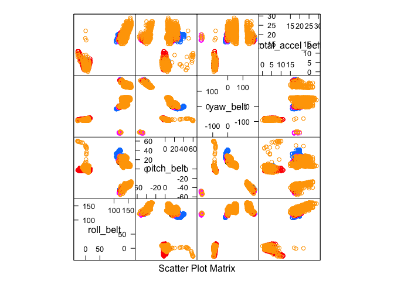
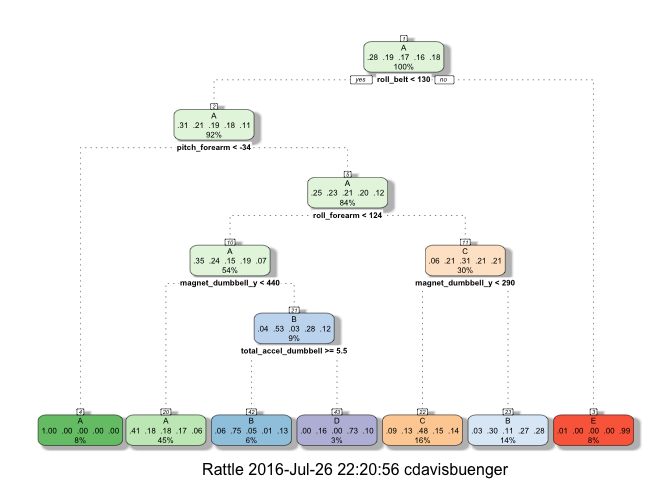

# Practical Machine Learning Course Project
C. Davis Buenger  
July 25, 2016  


### Machine Learning Project
Using devices such as Jawbone Up, Nike FuelBand, and Fitbit it is now possible to collect a large amount of data about personal activity relatively inexpensively. These type of devices are part of the quantified self movement – a group of enthusiasts who take measurements about themselves regularly to improve their health, to find patterns in their behavior, or because they are tech geeks. One thing that people regularly do is quantify how much of a particular activity they do, but they rarely quantify how well they do it. In this project, your goal will be to use data from accelerometers on the belt, forearm, arm, and dumbell of 6 participants. They were asked to perform barbell lifts correctly and incorrectly in 5 different ways. More information is available from the website here: <http://groupware.les.inf.puc-rio.br/har> (see the section on the Weight Lifting Exercise Dataset).

## Data

The training data for this project are available here:

<https://d396qusza40orc.cloudfront.net/predmachlearn/pml-training.csv>

The test data are available here:

<https://d396qusza40orc.cloudfront.net/predmachlearn/pml-testing.csv>

The data for this project come from this source: <http://groupware.les.inf.puc-rio.br/har>. If you use the document you create for this class for any purpose please cite them as they have been very generous in allowing their data to be used for this kind of assignment.

## Preprocessing
I downloaded the above data ans saved them as "MLprojtrain.csv" and "MLprojtest.csv," and then load them into R.

```r
setwd("~/Dropbox/Coursera")
training<-read.csv("MLprojtrain.csv")
testing<-read.csv("MLprojtest.csv")
dim(testing);dim(training)
```

```
## [1]  20 160
```

```
## [1] 19622   160
```
As indicated above, the testing csv is too small to be used a s a traditional testing set. Thus we partition the training set into a training set and a "testing" set which we will call "validation."

```r
set.seed(2322)
library(caret)
inTrain<-createDataPartition(training$classe,p=0.6,list=F)
validation<-training[-inTrain,]
training<-training[inTrain,]
```
A quick examination of the data set reveals that there are many columns which are virtually empty. I have shown only the 13-18th column summaries for brevity, but many other columns are similar. 

```r
summary(training[,13:18])
```

```
##  kurtosis_picth_belt kurtosis_yaw_belt skewness_roll_belt
##           :11524            :11524              :11524   
##  #DIV/0!  :   19     #DIV/0!:  252     #DIV/0!  :    7   
##  47.000000:    4                       0.000000 :    3   
##  -0.150950:    3                       -0.003095:    1   
##  -0.684748:    3                       -0.029284:    1   
##  1.326417 :    3                       -0.037647:    1   
##  (Other)  :  220                       (Other)  :  239   
##  skewness_roll_belt.1 skewness_yaw_belt max_roll_belt   
##           :11524             :11524     Min.   :-94.30  
##  #DIV/0!  :   19      #DIV/0!:  252     1st Qu.:-88.00  
##  0.000000 :    3                        Median : -6.35  
##  6.855655 :    3                        Mean   :-10.34  
##  -0.189082:    2                        3rd Qu.: 11.78  
##  -0.475418:    2                        Max.   :177.00  
##  (Other)  :  223                        NA's   :11524
```
Here we construct a logical vector which indicates those columns which are virtually empty.

```r
x<-rep(0,160)
for(i in 1:160){
      f<-training[,i]==""
      n<-sum(f, na.rm=T)
      if(n<300){x[i]=TRUE}
}
x<-as.logical(x)
```
Additionally many columns contain nas and we remove those here, and subset the training set based on the logical vector

```r
for(i in 1:160){if(sum(is.na(training[,i]))>100){x[i]=F}}
trutrain<-training[x]
```
Further analysis of the trutrain data set reveals that first 7 columns are lables for each measurement. I remove these and finally have a tidy data set to perform machine learning algorithms on.

```r
z<-rep(1,60)
for(i in 1:7){z[i]=0}
z<-as.logical(z)
trutrain<-trutrain[z]
```
## Initial Analysis of Data Shape

A quick look at the trutrain data set reveals 52 variables to base our prediction on.

```r
names(trutrain)
```

```
##  [1] "roll_belt"            "pitch_belt"           "yaw_belt"            
##  [4] "total_accel_belt"     "gyros_belt_x"         "gyros_belt_y"        
##  [7] "gyros_belt_z"         "accel_belt_x"         "accel_belt_y"        
## [10] "accel_belt_z"         "magnet_belt_x"        "magnet_belt_y"       
## [13] "magnet_belt_z"        "roll_arm"             "pitch_arm"           
## [16] "yaw_arm"              "total_accel_arm"      "gyros_arm_x"         
## [19] "gyros_arm_y"          "gyros_arm_z"          "accel_arm_x"         
## [22] "accel_arm_y"          "accel_arm_z"          "magnet_arm_x"        
## [25] "magnet_arm_y"         "magnet_arm_z"         "roll_dumbbell"       
## [28] "pitch_dumbbell"       "yaw_dumbbell"         "total_accel_dumbbell"
## [31] "gyros_dumbbell_x"     "gyros_dumbbell_y"     "gyros_dumbbell_z"    
## [34] "accel_dumbbell_x"     "accel_dumbbell_y"     "accel_dumbbell_z"    
## [37] "magnet_dumbbell_x"    "magnet_dumbbell_y"    "magnet_dumbbell_z"   
## [40] "roll_forearm"         "pitch_forearm"        "yaw_forearm"         
## [43] "total_accel_forearm"  "gyros_forearm_x"      "gyros_forearm_y"     
## [46] "gyros_forearm_z"      "accel_forearm_x"      "accel_forearm_y"     
## [49] "accel_forearm_z"      "magnet_forearm_x"     "magnet_forearm_y"    
## [52] "magnet_forearm_z"     "classe"
```
Let's take a quick look at how the data is shaped. Here is a feature plot examining some of the variables.

```r
featurePlot(x = trutrain[,c("roll_belt","pitch_belt","yaw_belt","total_accel_belt")],y = trutrain$classe,plot = "pairs")
```

<!-- -->

I performed many plots like this to try to determine which variables to include in the machine learning and even performed princaple component analysis. Yet, none of these approaches seemed to simplify the situation. 

## A First Attempt to Predict Classe
As a first try I created an LDA model and a model and a tree model. As you can see below, the lda model had an acuracy of 0.6995 and the tree model had an acuraccy of 0.5282. 

```r
modla<-train(classe~., data=trutrain,method="lda")
confusionMatrix(validation$classe,predict(modla,validation))
```

```
## Confusion Matrix and Statistics
## 
##           Reference
## Prediction    A    B    C    D    E
##          A 1811   68  162  183    8
##          B  235  960  188   54   81
##          C  131  141  908  157   31
##          D   74   43  165  955   49
##          E   46  261  141  140  854
## 
## Overall Statistics
##                                           
##                Accuracy : 0.6995          
##                  95% CI : (0.6892, 0.7096)
##     No Information Rate : 0.2928          
##     P-Value [Acc > NIR] : < 2.2e-16       
##                                           
##                   Kappa : 0.6198          
##  Mcnemar's Test P-Value : < 2.2e-16       
## 
## Statistics by Class:
## 
##                      Class: A Class: B Class: C Class: D Class: E
## Sensitivity            0.7884   0.6517   0.5806   0.6414   0.8348
## Specificity            0.9241   0.9124   0.9268   0.9479   0.9138
## Pos Pred Value         0.8114   0.6324   0.6637   0.7426   0.5922
## Neg Pred Value         0.9134   0.9189   0.8987   0.9186   0.9736
## Prevalence             0.2928   0.1877   0.1993   0.1898   0.1304
## Detection Rate         0.2308   0.1224   0.1157   0.1217   0.1088
## Detection Prevalence   0.2845   0.1935   0.1744   0.1639   0.1838
## Balanced Accuracy      0.8563   0.7821   0.7537   0.7947   0.8743
```

```r
modFit<-train(classe~.,method="rpart",tuneLength=5, data= trutrain)
library(rattle)
fancyRpartPlot(modFit$finalModel)
```

<!-- -->

```r
confusionMatrix(validation$classe,predict(modFit,validation))
```

```
## Confusion Matrix and Statistics
## 
##           Reference
## Prediction    A    B    C    D    E
##          A 2013   98  113    0    8
##          B  657  669  151   41    0
##          C  656  129  583    0    0
##          D  558  330  166  232    0
##          E  214  384  169   28  647
## 
## Overall Statistics
##                                          
##                Accuracy : 0.5282         
##                  95% CI : (0.517, 0.5393)
##     No Information Rate : 0.5223         
##     P-Value [Acc > NIR] : 0.1519         
##                                          
##                   Kappa : 0.3823         
##  Mcnemar's Test P-Value : <2e-16         
## 
## Statistics by Class:
## 
##                      Class: A Class: B Class: C Class: D Class: E
## Sensitivity            0.4912  0.41553  0.49323  0.77076  0.98779
## Specificity            0.9416  0.86386  0.88220  0.86030  0.88945
## Pos Pred Value         0.9019  0.44071  0.42617  0.18040  0.44868
## Neg Pred Value         0.6286  0.85130  0.90753  0.98948  0.99875
## Prevalence             0.5223  0.20520  0.15065  0.03836  0.08348
## Detection Rate         0.2566  0.08527  0.07431  0.02957  0.08246
## Detection Prevalence   0.2845  0.19347  0.17436  0.16391  0.18379
## Balanced Accuracy      0.7164  0.63969  0.68772  0.81553  0.93862
```
In addition, I attempted to combine these two prediction models, but results were not much better.

```r
pred1<-predict(modFit,validation)
pred2<-predict(modla, validation)
predDF<-data.frame(pred1,pred2,classe=validation$classe)

combModFit<-train(classe~.,method="rpart", tuneLength=10,data=predDF)
confusionMatrix(validation$classe,predict(combModFit,predDF))
```

```
## Confusion Matrix and Statistics
## 
##           Reference
## Prediction    A    B    C    D    E
##          A 1755   68  217  183    9
##          B  214  970  199   54   81
##          C   70  141  969  157   31
##          D   64   44  160  969   49
##          E   36  221  107  132  946
## 
## Overall Statistics
##                                           
##                Accuracy : 0.7149          
##                  95% CI : (0.7048, 0.7249)
##     No Information Rate : 0.2726          
##     P-Value [Acc > NIR] : < 2.2e-16       
##                                           
##                   Kappa : 0.6404          
##  Mcnemar's Test P-Value : < 2.2e-16       
## 
## Statistics by Class:
## 
##                      Class: A Class: B Class: C Class: D Class: E
## Sensitivity            0.8205   0.6717   0.5866   0.6482   0.8477
## Specificity            0.9164   0.9144   0.9356   0.9501   0.9263
## Pos Pred Value         0.7863   0.6390   0.7083   0.7535   0.6560
## Neg Pred Value         0.9316   0.9251   0.8946   0.9198   0.9735
## Prevalence             0.2726   0.1840   0.2106   0.1905   0.1422
## Detection Rate         0.2237   0.1236   0.1235   0.1235   0.1206
## Detection Prevalence   0.2845   0.1935   0.1744   0.1639   0.1838
## Balanced Accuracy      0.8684   0.7931   0.7611   0.7991   0.8870
```
## Final Analysis with Random Forests

For my next attempt, I modeled with random forests.

```r
library(randomForest)
rfModel <- randomForest(classe ~ ., data = trutrain, importance = TRUE, ntrees = 10)
confusionMatrix(validation$classe,predict(rfModel,validation))
```

```
## Confusion Matrix and Statistics
## 
##           Reference
## Prediction    A    B    C    D    E
##          A 2228    4    0    0    0
##          B    4 1510    4    0    0
##          C    0   20 1346    2    0
##          D    0    0   11 1273    2
##          E    0    0    1    3 1438
## 
## Overall Statistics
##                                           
##                Accuracy : 0.9935          
##                  95% CI : (0.9915, 0.9952)
##     No Information Rate : 0.2845          
##     P-Value [Acc > NIR] : < 2.2e-16       
##                                           
##                   Kappa : 0.9918          
##  Mcnemar's Test P-Value : NA              
## 
## Statistics by Class:
## 
##                      Class: A Class: B Class: C Class: D Class: E
## Sensitivity            0.9982   0.9844   0.9883   0.9961   0.9986
## Specificity            0.9993   0.9987   0.9966   0.9980   0.9994
## Pos Pred Value         0.9982   0.9947   0.9839   0.9899   0.9972
## Neg Pred Value         0.9993   0.9962   0.9975   0.9992   0.9997
## Prevalence             0.2845   0.1955   0.1736   0.1629   0.1835
## Detection Rate         0.2840   0.1925   0.1716   0.1622   0.1833
## Detection Prevalence   0.2845   0.1935   0.1744   0.1639   0.1838
## Balanced Accuracy      0.9987   0.9915   0.9924   0.9971   0.9990
```
As you can see above, the random forest model acuratly predicted the classe on the validation set with 0.9935 acuracy.

Finally we make our predictions for the test set based on the random forest model. 

```r
predict(rfModel,testing)
```

```
##  1  2  3  4  5  6  7  8  9 10 11 12 13 14 15 16 17 18 19 20 
##  B  A  B  A  A  E  D  B  A  A  B  C  B  A  E  E  A  B  B  B 
## Levels: A B C D E
```
